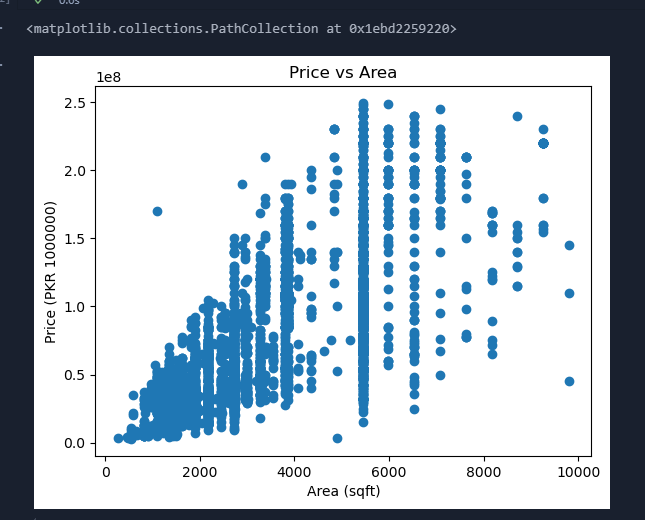

uhh this started as a mchine learning model but has now turned into a data visualization. you can see the data in `property.csv` visualized as a graph by downloading the source code and running all the code cells in `viz.ipynb`.

